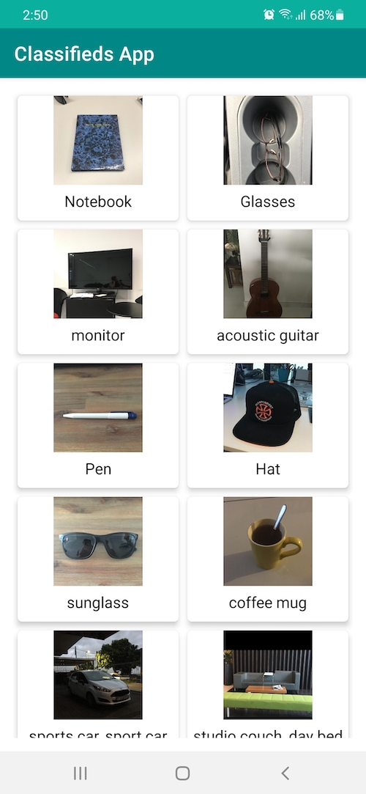
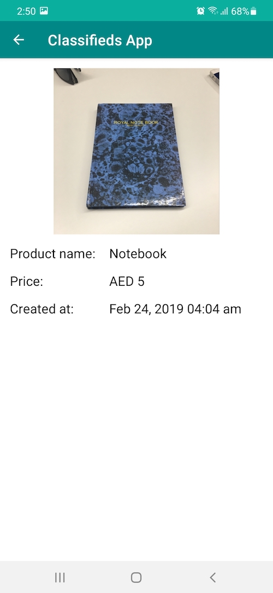

# Classifieds App

## Functionality
The app's functionality includes:
1. Fetch a list of products form a remote api & show them in `RecyclerView`.
2. When an item is selected from `RecyclerView` it will load the item detials in Detail Screen.
3. The app uses a custom `image_cache_lib` to cache images. The library support `DISK_CACHE` and `MEMORY_CACHE`.
4. On first load the app saves the products in a local database & on subsequent load - the items are loaded from local DB.
5. The app supports `SwipeRefreshLayout` to pull to refresh `RecyclerView` content from Remote source.

## Architecture
The app uses clean architecture with `MVVM(Model View View Model)` design pattern. 
MVVM provides better separation of concern, easier testing, Live data & lifecycle awareness, etc.

### UI
The UI consists of two screen
1. `MainActivity.kt` - Initial screen. Shows list of products.
2. `DetailActivity.java` - Shows detail data about a product item.

### Model
Model is generated from `JSON` data into a Kotlin data class.
In addition entity class has been added for room database along with `Type converter` for saving/retrieving custom object data.

### ViewModel

`MainViewModel.kt`

Used for fetching product listing & update livedata. Also send out the status of the network call like Loading, Success, Error using `sealed` class.

`DetailViewModel.kt`

Used for converting & checking detail data.

### Dependency Injection
The app uses `Dagger-hilt` as a dependency injection library.

The `ApplicationModule.kt` class provides  `Singleton` reference for `Retrofit`, `OkHttpClient`, `Repository` etc.

### Network
The network layer is composed of Repository, ApiService.
`ListingApi` - Is an interface containing the suspend functions for retrofit API call.

`ListingRepository` - Holds the definition of the remote/local repository call.

## Building

You can open the project in Android studio and press run.
Android Studio version used to build the project: Arctic fox 2020.3.1

Gradle plugin used in the project will require `Java 11.0` to run.

you can set the gradle jdk in `Preferences->Build Tools->Gradle->Gradle JDK`

## Libraries used
1.  Android appcompat, core, constraint layout, Material Support.
2.  Android View Binding
3. `Hilt` for dependency injection
4. `Retrofit` for REST API communication
5. `Coroutine` for Network call
6. `Lifecycle`, `ViewModel`
7. `LiveData`
8. `Room` for local database.
9. **`image_cache_lib`** for image caching & loading.
10. `Swipe Refresh Layout` for pull-to-refresh  `RecyclerView`.
11. `Mockito` & `Junit` for Unit testing.
12. `Robolectric` for Instrumentation testing
13. `Truth` for Assertion in testing.
14. `Espresso` for UI testing.

## Testing

Unit and integration testing has been added for `MainViewModel` , `DetailViewModel`, `ListingRepository` & `ResultPercelableTest`.

### `MainViewModelTest.kt`

Test the viewmodel of the app using `CoroutineRule` & `LiveData Observer`.

The test cases comprise of testing different states like Loading, Success, Error with fake data for testing listing response.

### `ListingRepository.kt`

Test the Repository of the app using `Robolectric`.

The test comprises of testing the functionality of Product Room Database like Insertion, Remove, Get saved listings etc.

[Mock Webserver](https://github.com/square/okhttp/tree/master/mockwebserver) is used to test the Network api response in case of successful data, empty, failed case.

UI testing has been added for `MainActivity` & `DetialActivity` using `Espresso`.

## Screenshots

Initial Screen               |  Detail Screen                  
:------------------------:|:------------------------:
    |  

